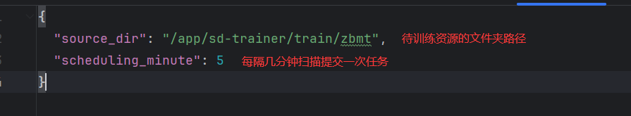
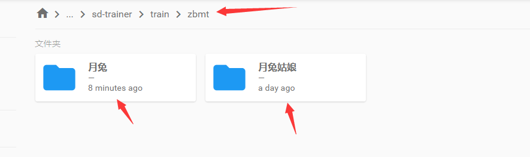
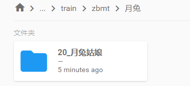
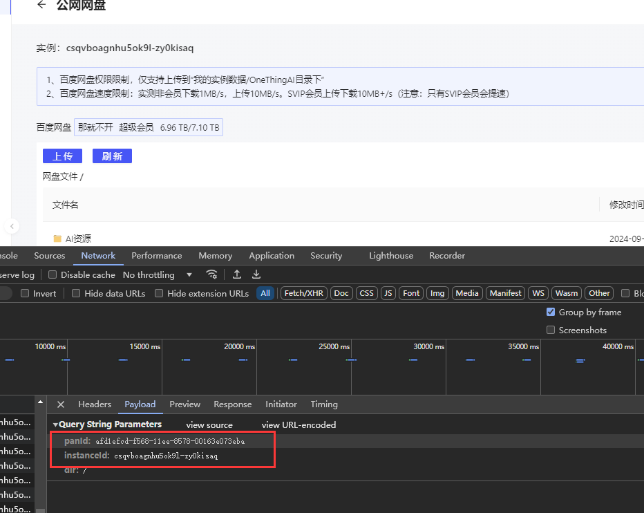

# 下载依赖
pip install -r requirements.txt
# 运行命令：
nohup python main.py > output.log 2>&1 &

# 查看日志：
tail -500f output.log

# finished_cache
finished_cache里面存放的是已经训练完的资源文件夹，如果是第一次运行脚本清空里面的内容或者直接删除该文件
# mark_folder_download
mark_folder_download里面存放的是从百度云盘上下载的打标素材文件夹，如果是第一次运行脚本清空里面的内容或者直接删除该文件

# config.json
config.json存放的是配置文件，需要根据自己的需求进行修改配置

如我这里放了两个需要训练的资源文件夹，就指定到它的上级就行了

# request.json
请求参数，其他内容都不需要关注
将**payload**部分通过配置文件toml译成json即可
将**header**部分的Cookie部分建议换成实际请求里的，推测不同容器里面的token不一样，混入了容器id

**ps: 我未对比过json是否和toml完全一致，为了确定稳定性建议直接复制请求接口里的请求体内容**

# 配置文件说明：
**source_dir:** 打标素材的文件夹路径，也是百度云盘下载的目的文件夹路径。由于onethingAI的百度云下载链接对目的文件夹路径做了权限限制， 只能下载到/root/onethingai-tmp
但应该是做了文件夹挂载映射的，/root/onethingai-tmp/train/能直接映射到/app/sd-trainer/train目录下，所以这个配置保持默认/root/onethingai-tmp/train/即可

**lora_output_path**: 最终训练好的lora的目的路径，保持默认即可/app/sd-trainer/output/

**scheduling_minute**: 每隔多少分钟触发一次训练任务

**url**: 训练lora任务的url，如果是onething上直接部署的话，填http://127.0.0.1:7860即可。如果是本地环境调试填类似https://csqvboagnhu5ok9l-zy0kisaq-sdwebui.instance.onethingbusiness.com

**mark_pan_dir**: 百度云盘素材打标文件夹的源路径

**lora_pan_upload_dir**: 训练好的lora，需要上传的百度云盘目的路径

**cookie**: lora训练任务请求时的cookie，去页面请求一次复制

**Authorization**: 百度云相关的接口需要，测试了好像是固定的，但可能也是有几天的日期，操作一次百度云相关接口比如刷新然后替换

**panId**: 操作一次百度云相关接口比如刷新然后替换

**instanceId**: 操作一次百度云相关接口比如刷新然后替换
